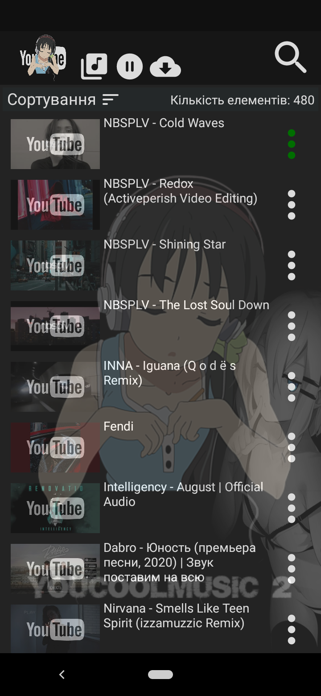
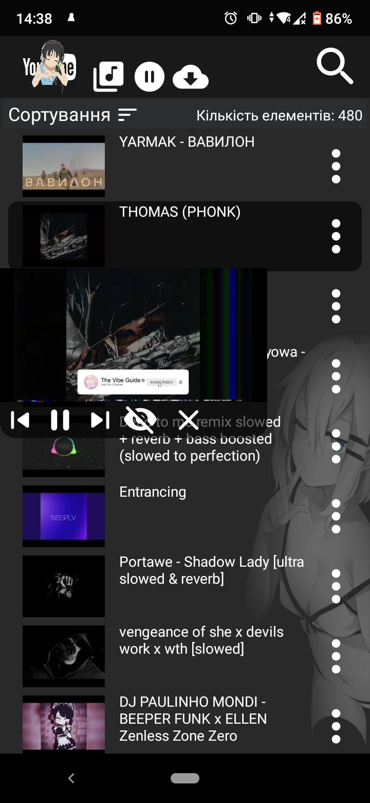
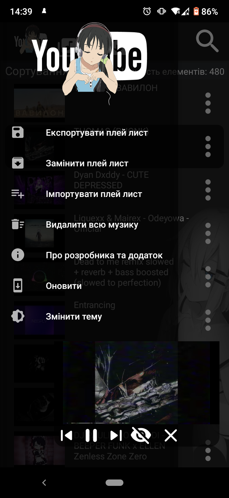
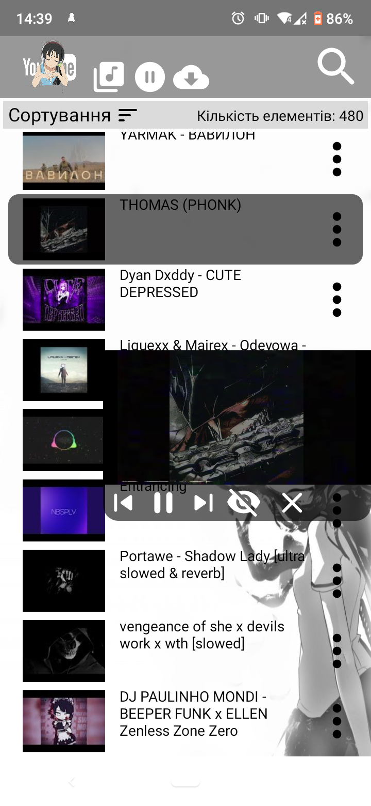
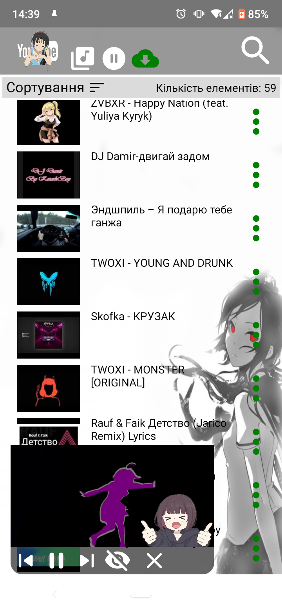
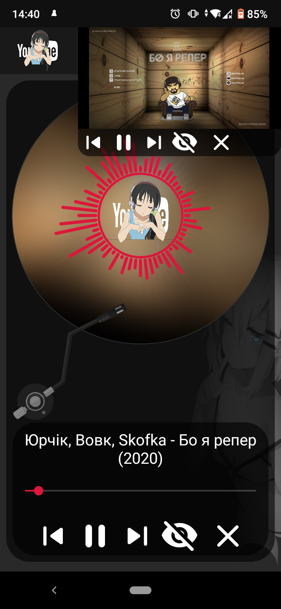
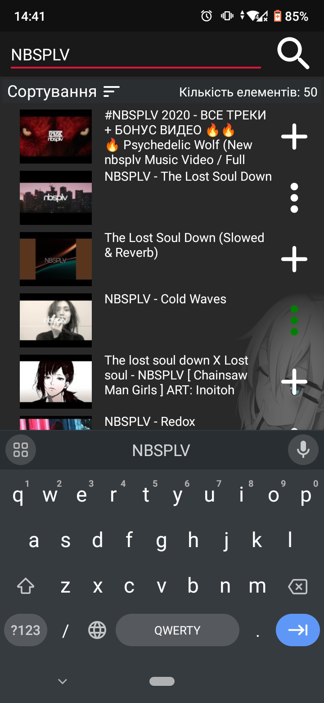

<p align="center"></p>
<h1 align="center">YouCoolMusic2</h1>

## Description
<b>EN:</b>

This is a **YouCoolMusic2** music application created in the **Java** programming language.

My analogue is **YouTube Music** and **YouTube Premium**. Continuation of the previous project [**YouCoolMusic**](https://github.com/CoolOtaku/YouCoolMusic).

The app uses the ***YouTube API KEY*** to search for videos on **YouTube**. [References to documentation](https://developers.google.com/youtube/v3/docs/search/list). 
Using this **API** key occurs in the following lines:

```java
48    public static final String API_KEY_1 = "[YOU_YouTube_API_KEY_1]";
49    public static final String API_KEY_2 = "[YOU_YouTube_API_KEY_2]";
``` 

Link to file from [**YouTube_API_KEY**](app/src/main/java/com/example/youcoolmusic2/App.java).

<b>UA:</b>

Це музичний додаток **YouCoolMusic2** створений на мові програмування **Java**.

Мій аналог - **YouTube Music** та **YouTube Premium**. Продовження попереднього проєкту [**YouCoolMusic**](https://github.com/CoolOtaku/YouCoolMusic).

В додатку використовується ***YouTube API KEY*** для пошуку відео в **YouTube**. [Посилання на документацію](https://developers.google.com/youtube/v3/docs/search/list). 
Використання цього **API** ключа зустрічається таких рядках:

```java
48    public static final String API_KEY_1 = "[YOU_YouTube_API_KEY_1]";
49    public static final String API_KEY_2 = "[YOU_YouTube_API_KEY_2]";
```                                

Посилання на файл із [**YouTube_API_KEY**](app/src/main/java/com/example/youcoolmusic2/App.java).

#
## Screenshots
<p align="center">
  
  
  
  
  
  
  
  
</p>

#
## Technologies used
<b>EN:</b>
- Creating an application using the **Java Android SDK**
- Working with the [**YouTube API**](https://developers.google.com/youtube/v3)
- Opening windows on top of all other programs (***SYSTEM_ALERT_WINDOW***)
- Using the music player in the status bar
- Using the service to play music in the background (***FOREGROUND_SERVICE***)
- Working with the local database [**SQLiteOpenHelper**](https://developer.android.com/reference/android/database/sqlite/SQLiteOpenHelper)
- Working with files (Saving and importing playlists)
- Using the element interface to display a list of elements from an array ([**RecyclerView**](https://developer.android.com/reference/androidx/recyclerview/widget/RecyclerView))
- Image caching and rendering via [**Picasso**](https://square.github.io/picasso/)
- Working with the **JSON** format
- Multi streaming
- Using a third-party library to display **YouTube** videos ([**android-youtube-player**](https://github.com/PierfrancescoSoffritti/android-youtube-player))
- Using a third-party library for sound visualization ([**Audio Visualizer**](https://github.com/gauravk95/audio-visualizer-android))
- Use of [**Chaquopy**](https://chaquo.com/chaquopy/) technology to download videos via [**youtube-dl**](https://github.com/ytdl-org/youtube-dl)
- Created own application update system
- Changing the design theme

<b>UA:</b>
- Створення додатка за допомогою **Java Android SDK**
- Робота з [**YouTube API**](https://developers.google.com/youtube/v3)
- Відкриття вікон поверх усіх інших програм (***SYSTEM_ALERT_WINDOW***)
- Використання музичного плеєра в статус-барі
- Використання сервісу для відтворення музики у фоновому режимі (***FOREGROUND_SERVICE***)
- Робота з локальною базою даних [**SQLiteOpenHelper**](https://developer.android.com/reference/android/database/sqlite/SQLiteOpenHelper)
- Робота з файлами (Збереження та імпорт списків відтворення)
- Використання інтерфейсу елемента для відображення списку елементів з масиву ([**RecyclerView**](https://developer.android.com/reference/androidx/recyclerview/widget/RecyclerView))
- Кешування та відображення зображення через [**Picasso**](https://square.github.io/picasso/)
- Робота з форматом **JSON**
- Багато потоковість
- Використання сторонньої бібліотеки для відображення відеозаписів **YouTube** ([**android-youtube-player**](https://github.com/PierfrancescoSoffritti/android-youtube-player))
- Використання сторонньої бібліотеки для візуалізації звуків ([**Audio Visualizer**](https://github.com/gauravk95/audio-visualizer-android))
- Використання технології [**Chaquopy**](https://chaquo.com/chaquopy/) для завантажування відео через [**youtube-dl**](https://github.com/ytdl-org/youtube-dl)
- Створена власна система оновлення додатка
- Зміна теми оформлення

#
## License
```
© 2021, CoolOtaku (ericspz531@gmail.com)
```
